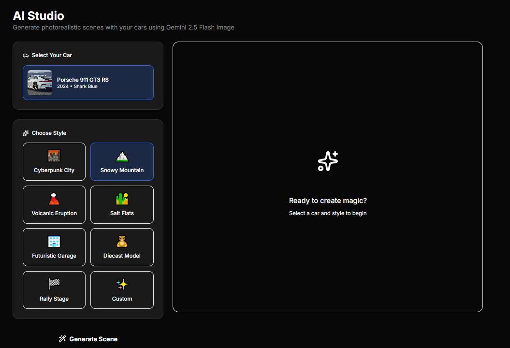
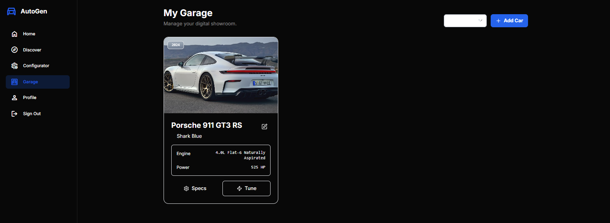
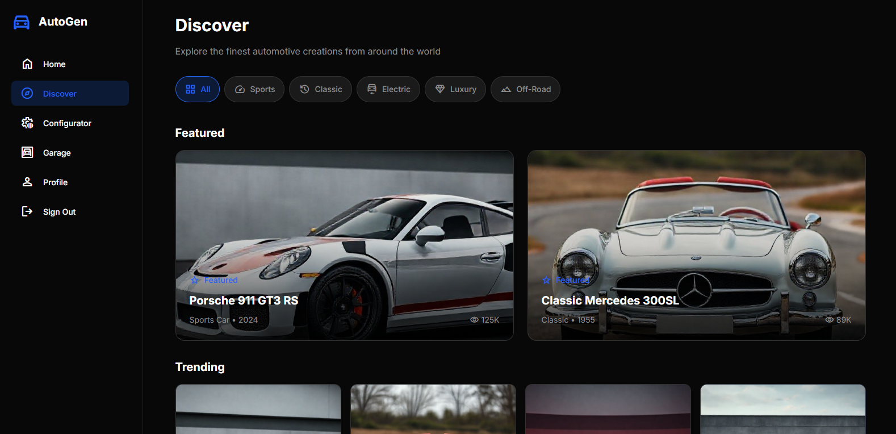

<div align="center">

# 🏎️ AutoGen Web

### *AI-Powered Creative Studio for Automotive Enthusiasts*

**Transform Your Car Photos into Professional Automotive Art**

[](https://react.dev/)
[](https://www.typescriptlang.org/)
[](https://vitejs.dev/)
[](https://ai.google.dev/)
[](https://supabase.com/)

[🚀 Live Demo](#) • [📱 Mobile App](../AutoStudio-mobile) • [📖 Documentation](../README.md)

</div>

---

## 📖 Table of Contents

- [🎯 What is AutoGen Web?](#-what-is-autogen-web)
- [✨ Key Features](#-key-features)
- [🎨 AI Creative Studio](#-ai-creative-studio)
- [🚗 Smart Digital Garage](#-smart-digital-garage)
- [🌐 Social Platform](#-social-platform)
- [🛠️ Technology Stack](#️-technology-stack)
- [🚀 Quick Start](#-quick-start)
- [📁 Project Structure](#-project-structure)
- [🔧 Configuration](#-configuration)
- [🎥 Features Showcase](#-features-showcase)
- [📱 Mobile Companion](#-mobile-companion)
- [🤝 Contributing](#-contributing)

---

## 🎯 What is AutoGen Web?

**AutoGen Web** is a professional-grade **React 19** web application that revolutionizes automotive photography through **Google Gemini AI**. It's the creative powerhouse of the AutoGen ecosystem, designed for car enthusiasts, collectors, and content creators who want to transform ordinary car photos into cinematic automotive art.

### The Core Problem We Solve

Taking professional photos of cars is:
- ❌ **Expensive** - Professional photographers charge hundreds per shoot
- ❌ **Time-Consuming** - Finding perfect locations and lighting takes hours
- ❌ **Skill-Intensive** - Requires Photoshop expertise and camera knowledge

### Our Solution

With AutoGen Web, you can:
- ✅ **Upload a simple driveway photo** of your car
- ✅ **Choose a style** (Cyberpunk City, Snowy Mountain, Rally Stage, etc.)
- ✅ **Generate photorealistic images** where your car is transported to professional locations
- ✅ **Create cinematic videos** from still images using AI
- ✅ **Share with the community** on our integrated social platform

**All powered by Google Gemini 2.5 Flash Image ("Nano Banana") - no Photoshop skills required.**

---

## ✨ Key Features

### 🎨 **AI Creative Studio** (Flagship Feature)
Transform your car photos into professional automotive art with one click:
- **8 Style Presets**: Cyberpunk City, Snowy Mountain, Volcanic Eruption, Salt Flats, Futuristic Garage, Diecast Model, Rally Stage, Custom
- **Context-Aware Generation**: AI maintains your car's exact color, modifications, and identity while changing the environment
- **Narrative Prompting**: No prompt engineering needed - just select a style
- **Real-Time Preview**: See generated images instantly in a professional canvas
- **Save & Share**: Export to gallery or publish to social feed

### 🚗 **Smart Digital Garage**
AI-powered vehicle inventory management:
- **Auto-Spec Detection**: Upload photos → Gemini 3 Pro analyzes pixels → Auto-fills make, model, year, color, engine, horsepower
- **Modification Tracking**: AI detects aftermarket parts (wheels, spoilers, exhausts)
- **Multi-Image Support**: Store multiple angles of each vehicle
- **Rich Metadata**: Custom notes, visual descriptions for AI prompts
- **Organized Collections**: Sort by make, model, or year

### 🌐 **Social Platform**
Instagram-style community for car enthusiasts:
- **Masonry Feed**: Pinterest-like dynamic grid layout
- **Discover Page**: Filter by make/model, search trending tags
- **Interactions**: Like, comment, save posts
- **User Profiles**: Public garage showcase, bio, avatar
- **Real-Time Updates**: Live feed with Supabase subscriptions

### 🎥 **Video Generation**
Create cinematic motion from still images:
- **Google Veo Integration**: 5-second 1080p videos
- **Camera Controls**: Drone pan, zoom in, truck left/right
- **Social-Ready**: Perfect 16:9 or 9:16 aspect ratios
- **One-Click Export**: Download MP4 for Instagram/TikTok

### 🔍 **Grounded Search**
Validate car specs with real-world data:
- **Google Search Integration**: Fetch official specs from manufacturer sites
- **Fact-Checking**: Verify AI-detected information
- **Data Enrichment**: Auto-populate garage entries with verified data

---

## 🎨 AI Creative Studio

### How It Works

**Step 1: Select Your Car**
```typescript
// Choose from your digital garage
const selectedCar = {
  make: "Porsche",
  model: "911 GT3 RS",
  year: 2023,
  color: "Miami Blue",
  image_url: "https://..."
};
```

**Step 2: Choose a Style Preset**
- **Cyberpunk City**: Neon-lit streets, holographic billboards, rain reflections
- **Snowy Mountain**: Alpine pass, pristine powder, lens flares
- **Volcanic Eruption**: Lava flows, intense flames, apocalyptic atmosphere
- **Salt Flats**: Endless white plains, mirror reflections, minimalist
- **Futuristic Garage**: LED strips, polished concrete, studio lighting
- **Diecast Model**: 1/18 scale toy replica on hobbyist desk
- **Rally Stage**: WRC action shot, mud kicking, motion blur
- **Custom**: Write your own narrative prompt

**Step 3: AI Generation**
```typescript
// Engineered prompt construction
const prompt = `A photorealistic, ultra high-resolution shot of a Miami Blue 
2023 Porsche 911 GT3 RS. The car is positioned as the hero subject in a 
neon-lit cyberpunk cityscape with holographic billboards, rain-slicked streets 
reflecting purple and cyan lights. Cinematic lighting with neon reflections 
dancing across the car's glossy paint. Professional wide-angle lens, shallow 
depth of field, automotive magazine quality.`;

// Generate with Gemini 2.5 Flash Image
const result = await generateCarImageWithStyle(
  selectedCar.image_url,
  "cyberpunk",
  styleDescription,
  carDetails
);
```

**Step 4: Save & Share**
- Save to personal gallery
- Publish to social feed
- Export high-resolution PNG
- Generate video with Veo

### Prompt Engineering

AutoGen uses **sophisticated prompt construction** that combines:
1. **Vehicle Identity**: Specific make, model, year, color from your garage
2. **Environment Details**: Lighting, atmosphere, weather, location
3. **Photographic Techniques**: Lens type, depth of field, composition rules
4. **Quality Markers**: "Photorealistic", "ultra high-resolution", "magazine quality"

This ensures:
- ✅ Your car's modifications stay consistent (wheels, color, body kit)
- ✅ Professional automotive photography quality
- ✅ Accurate scene representation matching the style
- ✅ No generic "random sports car" outputs

---

## 🚗 Smart Digital Garage

### AI-Powered Auto-Fill

When you upload a car photo, **Gemini 3 Pro** analyzes every pixel:

```typescript
const analysis = await analyzeCarUpload([base64Image]);

// Returns structured JSON:
{
  "make": "Porsche",
  "model": "911 GT3 RS",
  "year": 2023,
  "color": "Miami Blue",
  "specs": {
    "engine": "4.0L Flat-6 Naturally Aspirated",
    "horsepower": 518,
    "mods": [
      "Aftermarket Exhaust System",
      "Carbon Fiber Rear Wing",
      "Custom BBS Wheels"
    ]
  }
}
```

### Features
- **Multi-Image Gallery**: Upload 3-10 photos per car
- **Manual Override**: Edit AI-detected specs
- **Visual Descriptions**: Add notes for better AI generation
- **Export Data**: Download garage as JSON
- **Search & Filter**: Find cars by make, model, or year

---

## 🌐 Social Platform

### Feed System
```typescript
// Masonry layout with dynamic columns
<div className="grid grid-cols-1 md:grid-cols-2 lg:grid-cols-3 gap-4">
  {posts.map(post => (
    <PostCard 
      image={post.media_url}
      caption={post.caption}
      likes={post.likes_count}
      car={post.car}
    />
  ))}
</div>
```

### Real-Time Updates
```typescript
// Subscribe to new posts
supabase
  .channel('posts')
  .on('postgres_changes', 
    { event: 'INSERT', schema: 'public', table: 'posts' },
    (payload) => setFeed(prev => [payload.new, ...prev])
  )
  .subscribe();
```

### Discover Page
- **Filter by Make**: Porsche, Ferrari, Lamborghini, McLaren, etc.
- **Search Tags**: #modified, #classic, #supercar, #jdm
- **Featured Creators**: Top contributors of the week
- **Trending Posts**: Most liked in past 24 hours

---

## 🛠️ Technology Stack

### Frontend
```json
{
  "react": "^19.2.0",           // Latest React with new JSX transform
  "react-dom": "^19.2.0",       // DOM renderer
  "react-router-dom": "^7.9.6", // SPA routing with data APIs
  "typescript": "~5.8.2",       // Full type safety
  "vite": "^6.2.0"              // Lightning-fast dev server & builds
}
```

### AI Integration
```json
{
  "@google/genai": "^1.30.0"    // Official Gemini SDK
}
```

**Models Used**:
- **Gemini 3 Pro** (`gemini-3-pro-preview`) - Car analysis, reasoning
- **Gemini 2.5 Flash** (`gemini-2.5-flash`) - Text generation, search
- **Gemini 2.5 Flash Image** (`gemini-2.5-flash-image`) - Image generation
- **Veo 3.1 Fast** (`veo-3.1-fast-generate-preview`) - Video generation

### Backend & Database
```json
{
  "@supabase/supabase-js": "^2.84.0"  // PostgreSQL + Auth + Storage
}
```

**Database Tables**:
- `profiles` - User accounts
- `cars` - Digital garage inventory
- `photoshoots` - AI-generated content
- `posts` - Social feed
- `likes` - Post interactions

### Styling & UI
```json
{
  "lucide-react": "^0.554.0"    // Icon library (500+ icons)
}
```

**Styling Approach**:
- **Tailwind CSS** - Utility-first with custom color palette
- **Dark Mode Design** - Deep charcoal (#121212) with electric accents
- **Responsive Grid** - Mobile-first breakpoints (sm, md, lg, xl)
- **Glassmorphism** - Frosted glass effects on overlays

### Build & Dev Tools
- **Vite 6.2** - Native ESM dev server, optimized production builds
- **TypeScript 5.8** - Strict mode, no implicit any
- **ESLint** - Code quality checks
- **Prettier** - Consistent formatting

---

## 🚀 Quick Start

### Prerequisites

- **Node.js** 18+ and npm/yarn
- **Supabase Account** (free tier: https://supabase.com)
- **Google AI Studio API Key** (free tier: https://ai.google.dev)

### Installation

```bash
# 1. Clone the repository
cd "d:\Personal project\autogen\Autogen-main"

# 2. Install dependencies
npm install

# 3. Create environment file
touch .env.local
```

### Environment Configuration

Edit `.env.local`:

```bash
# Supabase Configuration
VITE_SUPABASE_URL=https://eqacvrjbalyiodhohexy.supabase.co
VITE_SUPABASE_ANON_KEY=your_supabase_anon_key_here

# Google Gemini API
VITE_GEMINI_API_KEY=your_gemini_api_key_here
```

**Get Your Keys**:

1. **Supabase**:
   - Go to https://supabase.com/dashboard
   - Create new project
   - Settings → API → Copy URL and anon key

2. **Gemini API**:
   - Go to https://ai.google.dev/
   - Get API Key → Create key
   - Enable models: Gemini 3 Pro, Gemini 2.5 Flash, Veo

### Database Setup

```bash
# 1. Go to Supabase Dashboard → SQL Editor
# 2. Run the schema from supabase_schema.sql
# 3. Create storage buckets:
#    - Name: "garage" (public)
#    - Name: "studio" (public)
```

### Run Development Server

```bash
npm run dev
```

Open http://localhost:5173 in your browser.

### Build for Production

```bash
npm run build
npm run preview
```

---

## � Screenshots

### AI Creative Studio
Transform your car photos with one click using Gemini 2.5 Flash Image:

<div align="center">

<p><em>AI Studio - Select your car, choose a style preset, and generate cinematic automotive art</em></p>
</div>

---

### Studio Interface
Professional workspace with style presets and real-time preview:

<div align="center">

<p><em>Studio Interface - 8 style presets including Cyberpunk City, Snowy Mountain, Rally Stage, and more</em></p>
</div>

---

### Digital Garage
AI-powered car inventory with auto-detection:

<div align="center">

<p><em>Garage Manager - Upload photos and let AI automatically detect make, model, year, and specs</em></p>
</div>

---

### Discovery Feed
Instagram-style social platform for automotive enthusiasts:

<div align="center">

<p><em>Discover - Browse community creations, filter by make/model, and discover trending builds</em></p>
</div>

---

## �📁 Project Structure

```
Autogen-main/
├── src/                          # Source files (if using src/)
├── pages/                        # Route pages
│   ├── Feed.tsx                  # Social feed with masonry layout
│   ├── Discover.tsx              # Discovery page with filters
│   ├── Garage.tsx                # Car inventory manager
│   ├── Studio.tsx                # 🎨 AI Creative Studio (FLAGSHIP)
│   ├── Profile.tsx               # User profile & settings
│   └── Login.tsx                 # Authentication page
│
├── components/                   # Reusable components
│   ├── Layout.tsx                # Navigation + Sidebar wrapper
│   ├── AuthGuard.tsx             # Protected route HOC
│   ├── ApiKeyGuard.tsx           # Gemini API key validator
│   └── CarCard.tsx               # Reusable car display card
│
├── services/                     # Backend services
│   ├── geminiService.ts          # 🧠 ALL Gemini AI functions
│   │   ├── analyzeCarUpload()    # Auto-detect car specs
│   │   ├── generateCarImageWithStyle()  # Studio generation
│   │   ├── generateCarVideo()    # Veo video creation
│   │   ├── searchCarInfo()       # Grounded search
│   │   └── constructPrompt()     # Prompt engineering
│   │
│   └── supabaseClient.ts         # Database client config
│
├── App.tsx                       # Root component + routing
├── index.tsx                     # Entry point
├── types.ts                      # TypeScript interfaces
├── constants.ts                  # Gemini model names & config
│
├── supabase_schema.sql           # Complete database schema
├── package.json                  # Dependencies & scripts
├── vite.config.ts                # Vite configuration
├── tsconfig.json                 # TypeScript config
├── index.html                    # HTML template
└── README.md                     # This file
```

### Key Files Explained

**App.tsx** - Root component with routing:
```typescript
<HashRouter>
  <Routes>
    <Route path="/login" element={<Login />} />
    <Route path="/" element={<Layout />}>
      <Route path="feed" element={<Feed />} />
      <Route path="garage" element={<AuthGuard><Garage /></AuthGuard>} />
      <Route path="studio" element={<AuthGuard><Studio /></AuthGuard>} />
    </Route>
  </Routes>
</HashRouter>
```

**services/geminiService.ts** - AI brain of the application:
- 500+ lines of prompt engineering
- 6 main functions for different AI operations
- Structured JSON output parsing
- Error handling and retry logic

**pages/Studio.tsx** - The flagship creative workspace:
- Car selector from garage
- Style preset grid (8 presets + custom)
- Real-time generation canvas
- Save to gallery / publish to feed
- Cooldown timer for rate limiting

---

## 🔧 Configuration

### Vite Configuration

```typescript
// vite.config.ts
import { defineConfig } from 'vite';
import react from '@vitejs/plugin-react';

export default defineConfig({
  plugins: [react()],
  server: {
    port: 5173,
    open: true
  },
  build: {
    outDir: 'dist',
    sourcemap: false
  }
});
```

### TypeScript Configuration

```json
{
  "compilerOptions": {
    "target": "ES2020",
    "lib": ["ES2020", "DOM", "DOM.Iterable"],
    "module": "ESNext",
    "jsx": "react-jsx",
    "strict": true,
    "moduleResolution": "bundler",
    "resolveJsonModule": true,
    "isolatedModules": true,
    "esModuleInterop": true,
    "noEmit": true,
    "skipLibCheck": true
  }
}
```

### Tailwind Configuration

```javascript
// tailwind.config.js
module.exports = {
  content: [
    "./index.html",
    "./src/**/*.{js,ts,jsx,tsx}",
    "./pages/**/*.{js,ts,jsx,tsx}",
    "./components/**/*.{js,ts,jsx,tsx}"
  ],
  theme: {
    extend: {
      colors: {
        'carbon-950': '#0A0A0A',
        'carbon-900': '#121212',
        'carbon-800': '#1E1E1E',
        'carbon-700': '#2A2A2A',
        'carbon-500': '#6B6B6B',
        'carbon-300': '#A3A3A3',
        'neon-cyan': '#00D9FF',
        'primary': '#007AFF',
        'neon-purple': '#7f0df2'
      }
    }
  }
}
```

---

## 🎥 Features Showcase

### AI Studio Workflow

**1. Car Selection**
```typescript
// User selects from their garage
const cars = await supabase
  .from('cars')
  .select('*')
  .eq('user_id', user.id);

// Display in grid with thumbnails
<div className="space-y-3">
  {cars.map(car => (
    <CarSelector 
      car={car} 
      selected={selectedCar?.id === car.id}
      onClick={() => setSelectedCar(car)}
    />
  ))}
</div>
```

**2. Style Preset Selection**
```typescript
const STYLE_PRESETS = [
  {
    id: 'cyberpunk',
    name: 'Cyberpunk City',
    description: 'neon-lit cityscape with holographic billboards...',
    icon: '🌆'
  },
  // ... 7 more presets
];
```

**3. Generation**
```typescript
const handleGenerate = async () => {
  setIsLoading(true);
  
  const generatedImage = await generateCarImageWithStyle(
    selectedCar.image_url,
    selectedStyle.id,
    selectedStyle.description,
    {
      make: selectedCar.make,
      model: selectedCar.model,
      year: selectedCar.year,
      color: selectedCar.color
    }
  );
  
  setResult(generatedImage); // Base64 image
  setIsLoading(false);
};
```

**4. Save to Gallery**
```typescript
const handleSave = async () => {
  // Convert base64 to blob
  const blob = await fetch(result).then(r => r.blob());
  
  // Upload to Supabase storage
  const { data } = await supabase.storage
    .from('studio')
    .upload(`${userId}/${Date.now()}.png`, blob);
  
  // Save metadata to database
  await supabase.from('photoshoots').insert({
    user_id: userId,
    car_id: selectedCar.id,
    image_url: publicUrl,
    environment: selectedStyle.name
  });
};
```

### Garage Auto-Fill

```typescript
// Upload handler
const handleUpload = async (files: File[]) => {
  // Convert to base64
  const base64Images = await Promise.all(
    files.map(file => fileToBase64(file))
  );
  
  // Analyze with Gemini 3 Pro
  const analysisJson = await analyzeCarUpload(base64Images);
  const analysis = JSON.parse(analysisJson);
  
  // Pre-fill form
  setFormData({
    make: analysis.make,
    model: analysis.model,
    year: analysis.year,
    color: analysis.color,
    specs: analysis.specs
  });
};
```

---

## 📱 Mobile Companion

AutoGen Web has a **React Native mobile companion app** built with **Expo SDK 54** and **NativeWind v4**.

### Mobile App Features
- 📸 **Feed Screen**: Instagram-style with stories carousel
- 🚙 **Garage Grid**: 2-column layout with gradient overlays
- 🔍 **Discover**: Search and filter by make/model
- 👤 **Profile**: User stats and public garage
- 🔐 **Auth**: Same Supabase authentication
- 💾 **Sync**: Real-time sync with web app

### Same Backend, Different Interface
Both apps share:
- ✅ **Supabase Database** - Same tables, same data
- ✅ **Gemini API** - Same AI models
- ✅ **Authentication** - Same user accounts
- ✅ **Storage** - Same image buckets

**What you do on web instantly appears on mobile, and vice versa.**

### Mobile App Location
```
../AutoStudio-mobile/
```

[📱 View Mobile App Documentation](../AutoStudio-mobile/README.md)

---

## 🎨 Design Philosophy

### Color Palette

**Dark Mode Automotive Luxury**
```css
/* Backgrounds */
--carbon-950: #0A0A0A;   /* Pure black */
--carbon-900: #121212;   /* Main surface */
--carbon-800: #1E1E1E;   /* Elevated surface */
--carbon-700: #2A2A2A;   /* Borders */

/* Text */
--carbon-300: #A3A3A3;   /* Primary text */
--carbon-500: #6B6B6B;   /* Secondary text */

/* Accents */
--neon-cyan: #00D9FF;    /* Primary actions */
--primary: #007AFF;      /* iOS blue */
--neon-purple: #7f0df2;  /* Premium highlights */
```

### Typography
- **Headings**: Inter Black (font-display)
- **Body**: Inter Regular (font-sans)
- **Code**: Fira Code (font-mono)

### UI Principles
1. **Night Mode First** - Designed for late-night garage sessions
2. **Glassmorphism** - Frosted glass overlays for depth
3. **Automotive Aesthetic** - Inspired by luxury car UIs
4. **Performance** - 60fps animations, lazy loading
5. **Accessibility** - ARIA labels, keyboard navigation

---

## 🔐 Authentication & Security

### Authentication Flow

```typescript
// Login handler
const handleLogin = async (email: string, password: string) => {
  const { data, error } = await supabase.auth.signInWithPassword({
    email,
    password
  });
  
  if (data.session) {
    router.push('/garage');
  }
};

// Session management
useEffect(() => {
  supabase.auth.onAuthStateChange((event, session) => {
    setUser(session?.user ?? null);
  });
}, []);
```

### Protected Routes

```typescript
// AuthGuard.tsx
const AuthGuard = ({ children }: { children: React.ReactNode }) => {
  const [session, setSession] = useState<Session | null>(null);
  
  useEffect(() => {
    supabase.auth.getSession().then(({ data }) => {
      setSession(data.session);
    });
  }, []);
  
  if (!session) return <Navigate to="/login" />;
  return <>{children}</>;
};
```

### API Key Security

```typescript
// ApiKeyGuard.tsx - Validates Gemini API key
const ApiKeyGuard = ({ children }: { children: React.ReactNode }) => {
  const apiKey = import.meta.env.VITE_GEMINI_API_KEY;
  
  if (!apiKey || apiKey === 'MISSING_KEY') {
    return <ApiKeyMissingPage />;
  }
  
  return <>{children}</>;
};
```

**Security Best Practices**:
- ✅ Environment variables for secrets
- ✅ Row Level Security (RLS) on database
- ✅ Supabase Auth JWT tokens
- ✅ HTTPS only in production
- ✅ Input sanitization for SQL injection prevention

---

## 🤝 Contributing

We welcome contributions from the automotive and developer community!

### Development Workflow

```bash
# 1. Fork the repository
git clone https://github.com/yourusername/autogen

# 2. Create feature branch
git checkout -b feature/amazing-feature

# 3. Make changes and test
npm run dev

# 4. Commit with descriptive message
git commit -m "Add amazing feature: detailed description"

# 5. Push to your fork
git push origin feature/amazing-feature

# 6. Open Pull Request
```

### Coding Standards

- **TypeScript**: Use strict mode, define interfaces for all data
- **React**: Functional components with hooks
- **Naming**: camelCase for variables, PascalCase for components
- **Comments**: Explain "why", not "what"
- **Testing**: Test complex logic before PR

### Areas for Contribution

- 🎨 New style presets for Studio
- 🚗 Additional car makes/models in auto-detection
- 🌐 Internationalization (i18n)
- 📊 Analytics dashboard
- 🎥 Video editing features
- 🔍 Advanced search filters

---

## 📊 Performance Metrics

### Lighthouse Scores (Target)
- **Performance**: 95+
- **Accessibility**: 100
- **Best Practices**: 100
- **SEO**: 90+

### Optimization Techniques
- ⚡ **Vite**: Native ESM for instant HMR
- 🖼️ **Lazy Loading**: Images load on scroll
- 📦 **Code Splitting**: Dynamic imports for routes
- 🗜️ **Compression**: Gzip/Brotli enabled
- 🎯 **Tree Shaking**: Remove unused code

---

## 🐛 Troubleshooting

### Common Issues

**1. "API Key Missing" Error**
```bash
# Solution: Check .env.local file
cat .env.local
# Ensure VITE_GEMINI_API_KEY is set
```

**2. Supabase Connection Failed**
```bash
# Verify credentials in .env.local
# Check Supabase project is not paused
# Run database migrations from supabase_schema.sql
```

**3. Build Errors**
```bash
# Clear cache and reinstall
rm -rf node_modules package-lock.json
npm install
npm run dev
```

**4. AI Generation Fails**
```bash
# Check API quota at https://ai.google.dev/
# Verify image URL is accessible
# Check console for detailed error messages
```

---

## 📈 Roadmap

### Current Version: 1.0
- ✅ AI Creative Studio with 8 presets
- ✅ Smart garage with auto-detection
- ✅ Social feed and discovery
- ✅ Video generation with Veo
- ✅ Mobile companion app

### Future Features
- 🔜 **Batch Generation**: Generate multiple styles at once
- 🔜 **AI Chatbot**: Ask car-related questions
- 🔜 **Marketplace**: Buy/sell AI-generated prints
- 🔜 **Collaboration**: Share garage with friends
- 🔜 **Events**: Virtual car meets and competitions

---

## 📄 License

MIT License - See [LICENSE](LICENSE) file for details.

---

## 🌟 Why AutoGen Web?

### What Makes It Special

1. **Context-Aware AI**: Not just random car images - YOUR specific car with accurate color and mods
2. **Professional Quality**: Prompt engineering techniques from automotive photography
3. **No Skills Required**: Simple style selection, no Photoshop or prompt engineering needed
4. **Cross-Platform Sync**: Web + Mobile apps share the same backend
5. **Community-Driven**: Built by car enthusiasts, for car enthusiasts

### Perfect For

- 🏎️ **Car Collectors** - Showcase your garage with professional imagery
- 🔧 **Tuners & Modders** - Display your build progression
- 📸 **Content Creators** - Generate unique content for Instagram/YouTube
- 🎨 **Digital Artists** - Create automotive art without manual editing
- 👥 **Car Clubs** - Share member builds in a dedicated platform

---

## 🚗 Built with ❤️ by Automotive Enthusiasts

**AutoGen Web** transforms how car lovers interact with their passion. Whether you're showcasing a pristine classic, displaying your latest build, or creating content for social media, AutoGen makes professional automotive photography accessible to everyone.

### Your Car. Your Vision. Reimagined by AI.

---

<div align="center">

**[🌐 Launch App](#) • [📱 Get Mobile App](../AutoStudio-mobile) • [📖 Full Documentation](../README.md) • [💬 Join Community](#)**

Made with ❤️ and powered by Google Gemini AI

</div>
